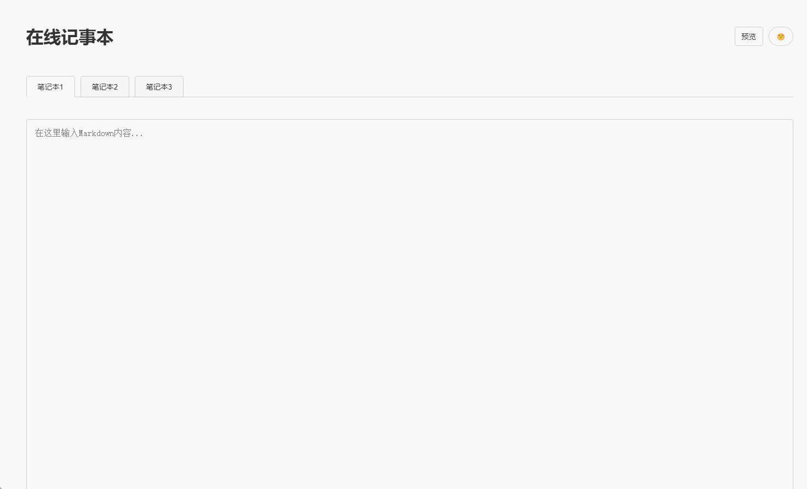

# 在线笔记本

一个极简的自用的在线web记事本，用来保存临时信息。

## 效果




在线demo（年底到期）：http://142.171.76.234:12345/

## 目前功能

- 三页笔记本，根据之前使用习惯，三个独立页面正好。
- 两秒停止编辑后自动保存。
- 深色/浅色主题切换。
- Markdown浏览。
- 临时文件缓存，支持缓存一个50MB以下的固定格式文件。


## 本地部署

```bash
git clone https://github.com/lissettecarlr/web-notepad.git
cd web-notepad
pip install flask
python app.py
```

## Docker部署

### 方式一：使用docker-compose
```bash
mkdir web-notepad && cd web-notepad
wget https://raw.githubusercontent.com/lissettecarlr/web-notepad/main/docker-compose.yml
docker-compose up -d
```

### 方式二：直接使用Docker命令
```bash
docker run -d -p 12345:12345 -v $(pwd)/notes:/app/notes lissettecarlr/web-notepad:latest
```


