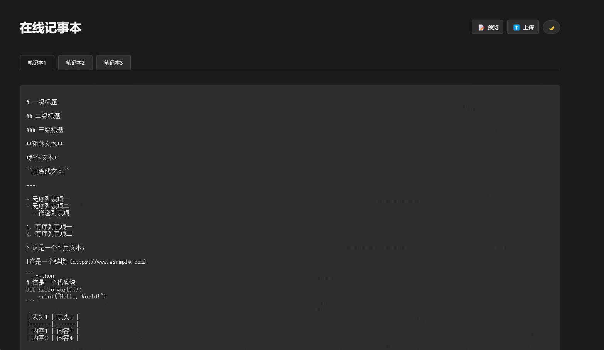

# 在线笔记本 Web Notepad

一个简单好用的在线web笔记本，用于快速记录和保存临时信息。

## ✨ 功能特性

- **三页笔记本** - 提供三个独立的笔记页面，方便分类记录不同内容
- **自动保存** - 停止编辑2秒后自动保存内容，无需手动操作
- **Markdown支持** - 内置Markdown编辑和预览功能，支持代码高亮
- **主题切换** - 支持浅色/深色主题自由切换
- **文件缓存** - 支持临时存储一个不超过500MB的文件
- **安全保护** - 文件上传需要密码验证（默认：1234，可通过环境变量修改）




## 🚀 快速开始

### 本地部署

```bash
# 克隆仓库
git clone https://github.com/lissettecarlr/web-notepad.git

# 进入项目目录
cd web-notepad

# 安装依赖
pip install flask flask_limiter

# 启动应用
python app.py
```

应用将在 http://localhost:12345 运行

### 使用Docker部署

#### 方式一：使用docker-compose（推荐）

```bash
# 创建目录并进入
mkdir web-notepad && cd web-notepad

# 下载docker-compose配置
wget https://raw.githubusercontent.com/lissettecarlr/web-notepad/main/docker-compose.yml

# 启动容器
docker-compose up -d
```

#### 方式二：直接使用Docker命令

```bash
docker run -d -p 12345:12345 -v $(pwd)/notes:/app/notes lissettecarlr/web-notepad:latest
```

## 🔧 自定义配置

### 修改上传密码

默认上传密码为`1234`，可通过环境变量修改：

```bash
# Linux/macOS
export UPLOAD_PASSWORD=your_password
python app.py

# Docker方式
docker run -d -p 12345:12345 -e UPLOAD_PASSWORD=your_password -v $(pwd)/notes:/app/notes lissettecarlr/web-notepad:latest
```

## 📝 使用提示

- 使用Markdown语法编写笔记，点击预览按钮查看渲染效果
- 上传文件后可以通过下载按钮随时获取,但同时只能保留一个文件，请在不需要时，手动删除，避免被恶意下载。


