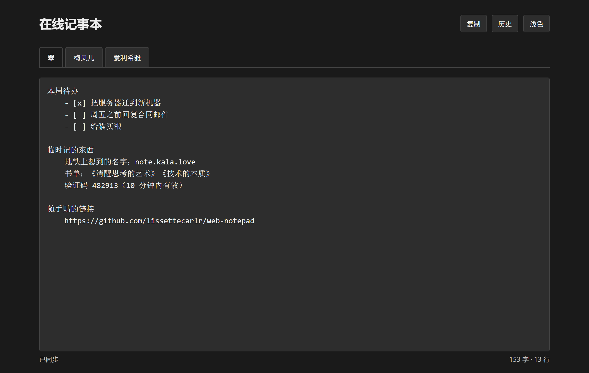
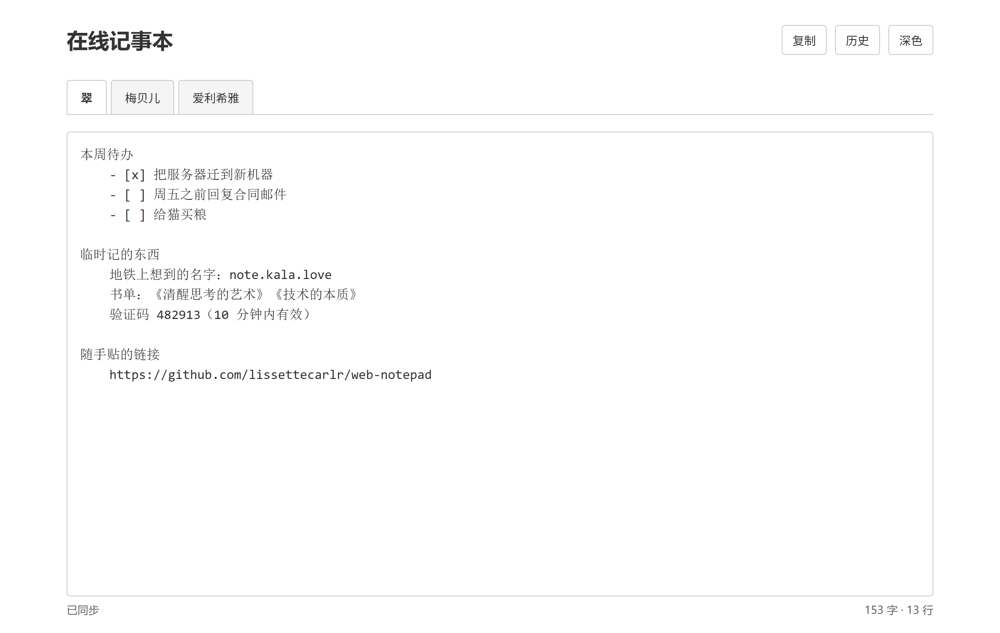
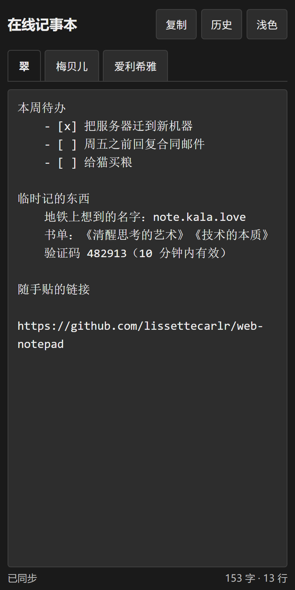
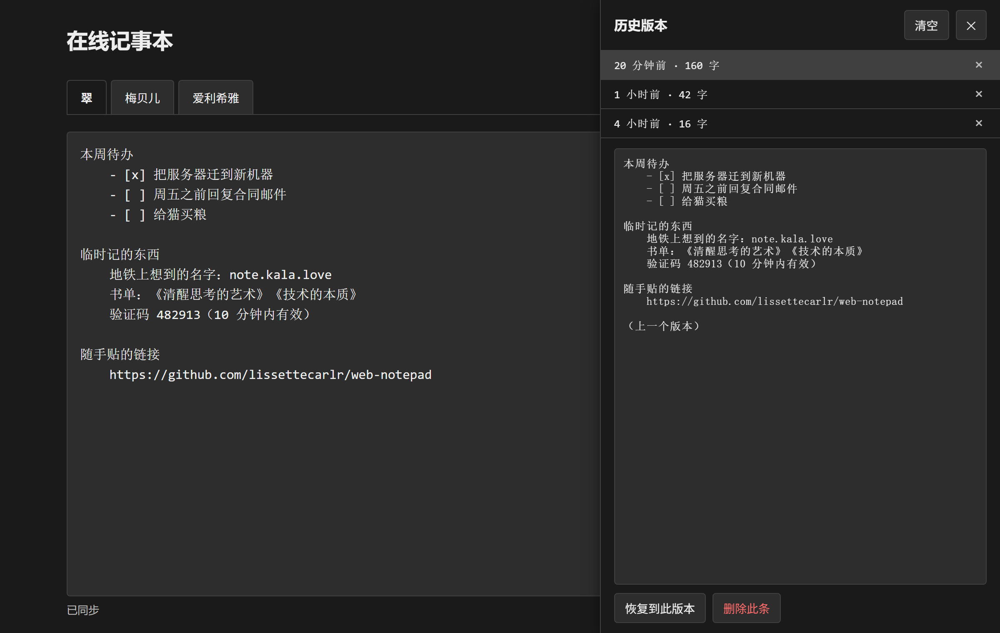

# Web Notepad

打开就能写，停下来就会存。给碎片信息用的极简在线记事本——待办、链接、验证码、一句话灵感，记完就走。



停笔即存 · 多设备先同步再允许编辑 · 改错了能翻历史 · 手机也能当剪贴板

<p align="center">
  
  &nbsp;
  
</p>



## 快速开始

Docker 一行启动（推荐）：

```bash
docker run -d -p 12345:12345 -v $(pwd)/notes:/app/notes lissettecarlr/web-notepad:latest
```

浏览器打开 http://localhost:12345 即可。笔记存在当前目录的 `notes/` 里。

用 compose 的话：

```bash
mkdir web-notepad && cd web-notepad
wget https://raw.githubusercontent.com/lissettecarlr/web-notepad/main/docker-compose.yml
docker compose up -d
```

本地直接跑：

```bash
git clone https://github.com/lissettecarlr/web-notepad.git
cd web-notepad
pip install -r requirements.txt
python app.py
```

同样是 http://localhost:12345 。

## 放到公网时加个密码

默认不鉴权，局域网随手开就行。挂到公网时，在 `docker-compose.yml` 里给 `NOTEPAD_TOKEN` 填一串随机字符：

```yaml
environment:
  NOTEPAD_TOKEN: "换成你自己的随机字符串"
```

重启后浏览器会弹一次，输过就记住。换设备或清缓存后再输一次。

前面如果还有反向代理，按层数设 `BEHIND_PROXY`：只有 1Panel / nginx / Caddy 一层填 `"1"`，Cloudflare 再套一层填 `"2"`，直接暴露保持 `"0"`。
