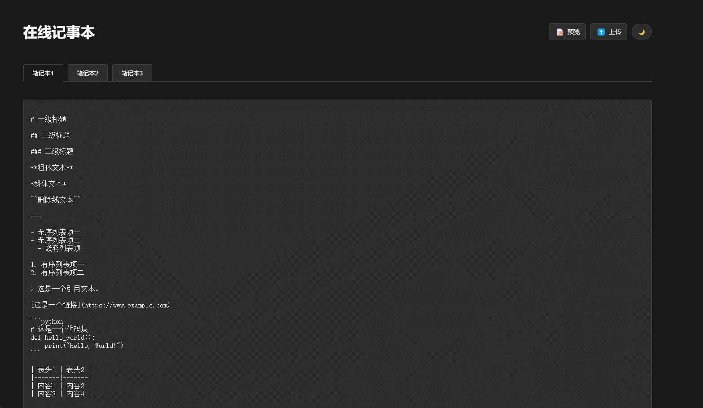

# 在线笔记本 Web Notepad

一个简单好用的在线 web 笔记本，用于快速记录和保存临时信息。

## ✨ 功能特性

- **多页笔记本** - 提供独立的笔记页面，方便分类记录不同内容
- **自动保存** - 停止编辑后自动保存内容，无需手动操作
- **历史版本** - 每次保存自动留存快照，可随时查看、恢复或删除
- **主题切换** - 支持浅色 / 深色主题自由切换
- **极简快速** - 纯文本编辑，无第三方前端库，秒开



## 🚀 快速开始

### 本地部署

```bash
# 克隆仓库
git clone https://github.com/lissettecarlr/web-notepad.git

# 进入项目目录
cd web-notepad

# 安装依赖
pip install -r requirements.txt

# 启动应用
python app.py
```

应用将在 http://localhost:12345 运行

### 使用 Docker 部署

#### 方式一：使用 docker-compose（推荐）

```bash
# 创建目录并进入
mkdir web-notepad && cd web-notepad

# 下载 docker-compose 配置
wget https://raw.githubusercontent.com/lissettecarlr/web-notepad/main/docker-compose.yml

# 启动容器
docker compose up -d
```

#### 方式二：直接使用 Docker 命令

```bash
docker run -d -p 12345:12345 -v $(pwd)/notes:/app/notes lissettecarlr/web-notepad:latest
```

### 设置访问密码（放公网时建议开启）

默认不需要密码，任何人拿到网址都能查看和修改笔记。放到公网上时，在 `docker-compose.yml` 里给 `NOTEPAD_TOKEN` 填一串随机字符：

```yaml
environment:
  NOTEPAD_TOKEN: "换成你自己的随机字符串"
```

重启容器后，浏览器首次打开会弹窗要求输入这串字符，输一次即记住，之后不再询问。换设备或清除浏览器数据后重新输入即可。

如果服务前面挂了 nginx / Caddy / Cloudflare 等反向代理，同时把 `BEHIND_PROXY` 设为 `"1"`。
